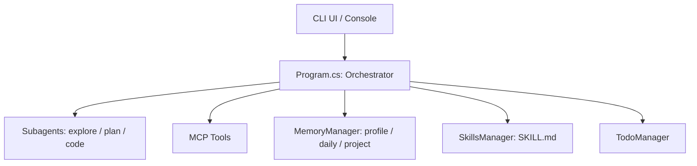
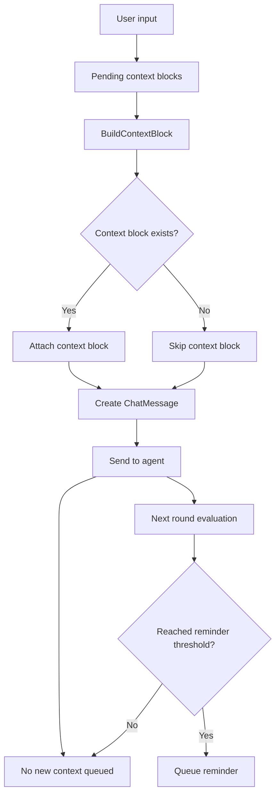

# YCode CLI

.NET 10 的命令行 AI 代理项目，结合 Subagent、MCP 工具、记忆管理与技能加载，用于学习与二次扩展。

## 特性
- **Subagent**：explore / plan / code 子代理隔离上下文
- **MCP 工具**：通过 Model Context Protocol 扩展文件与系统能力
- **记忆管理**：profile / daily / project 三级记忆与检索
- **技能加载**：YAML + Markdown 的技能包按需加载
- **交互式体验**：流式输出与可视化工具调用提示

## 快速开始
```bash
# 构建
 dotnet build

# 运行（本地调试）
 dotnet run --project YCode.CLI\YCode.CLI.csproj
```

## 配置
```bash
 YCODE_AUTH_TOKEN=your_api_key
 YCODE_API_BASE_URI=https://api.deepseek.com
 YCODE_MODEL=deepseek-chat

 # 可选（Context7 MCP）
 YCODE_CONTEXT7=your_context7_api_key
```

## 设计分层


## 消息注入流程


## 贡献与反馈
这是一个学习项目，欢迎：
- **提出问题**：报告 bug 或建议改进
- **分享经验**：交流 Microsoft Agents AI 使用心得
- **扩展功能**：基于项目实现更多代理类型或技能
- **改进文档**：帮助完善使用说明和示例

## 参考资源
- [Microsoft Agents AI 文档](https://learn.microsoft.com/en-us/dotnet/agents/)
- [MCP 协议规范](https://spec.modelcontextprotocol.io/)
- [Kode 项目](https://github.com/shareAI-lab/Kode) (Python实现的参考)

## Star History
[](https://star-history.com/#lyq-lin/YCode.CLI&Date)

## 许可证
MIT License
